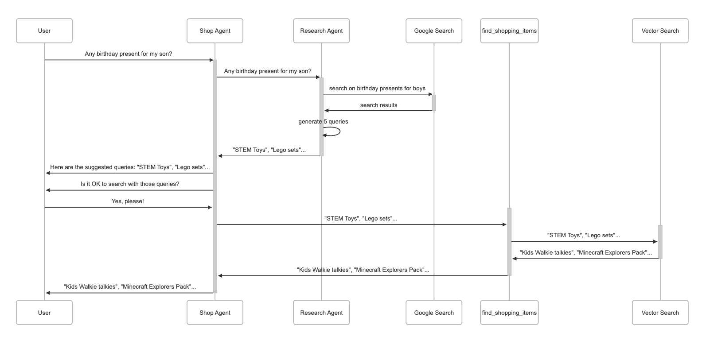

# E-commerce Generative Recommendation with ADK, Vector Search, and OLLAMA

This repository demonstrates how to build an advanced recommendation engine for e-commerce using a multi-agent architecture powered by ADK, vector search, and OLLAMA.

## What is Generative Recommendation?

Generative recommendation is an AI-driven approach that goes beyond keyword matching. It interprets user intent, expands queries, and uses external research to generate richer recommendations.

### Key capabilities

- **Understand and expand user intent**
  - The system interprets the underlying need behind a query, not just the exact words. For example, a request for a "birthday present for a 10-year-old boy" becomes a broader product exploration.

- **Leverage external research**
  - The process can incorporate market research through tools like Google Search. This helps identify popular product categories and real-world buying behaviors for the given intent.

- **Generate improved search queries**
  - The AI creates more specific and diverse queries based on the original request. Examples include "educational toys for 10-year-olds," "adventure books for boys," and "coding kits for kids."

### Why it matters

Instead of returning limited results, generative recommendation proactively suggests relevant ideas and search paths. This makes product discovery more intelligent and user-centric.

## Architecture Overview

The system is designed as a multi-agent pipeline:

1. **Intent analysis** — interpret the user request and extract the underlying need.
2. **Research and query generation** — use external data sources to discover related search concepts.
3. **Recommendation synthesis** — combine the results into targeted product suggestions.

The architecture is visualized in the following flow:

## Summary

This tutorial walks through building a multi-agent e-commerce recommendation system focused on generative recommendations.

It demonstrates how to:

- interpret user intent,
- perform external research,
- generate richer search queries,
- and deliver more relevant product recommendations using ADK and external search capabilities.

## Notes

- The repository emphasizes an intelligent recommendation workflow rather than a static product search.
- The approach is particularly suited for scenarios where users benefit from idea generation and exploration, such as gift shopping or inspiration-driven commerce.